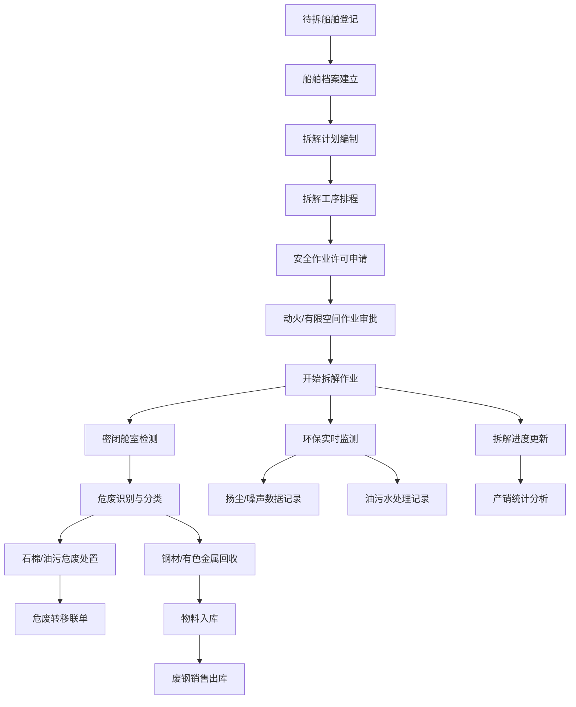

## 1. 产品概述

废旧船舶拆解管理Web系统是专为拆船厂设计的全流程管理平台，覆盖船舶从入厂登记到拆解完成、危废处置、物料回收的全生命周期管理。系统解决拆船厂在拆解作业、危废管理、环保监测、安全管控等方面的痛点，实现数字化、规范化、智能化管理。

- 主要用途：拆船厂船舶拆解全过程管理，涵盖档案、计划、危废、回收、安全、环保、统计七大业务模块
- 目标用户：拆船厂管理人员、安全工程师、环保专员、物料管理员、统计人员
- 产品价值：提升拆解效率、规范危废处置、强化安全管控、确保环保合规、实现数据溯源

## 2. 核心功能

### 2.1 用户角色

| 角色 | 注册方式 | 核心权限 |
|------|----------|----------|
| 系统管理员 | 系统内置 | 全部功能权限、用户管理、系统配置 |
| 生产管理员 | 管理员创建 | 船舶档案、拆解计划、进度管理 |
| 安全工程师 | 管理员创建 | 安全作业、动火许可、有限空间作业 |
| 环保专员 | 管理员创建 | 危废处置、环保监测、油污水处理 |
| 物料管理员 | 管理员创建 | 物料回收、废钢销售、库存管理 |
| 统计人员 | 管理员创建 | 产销统计、报表生成、数据导出 |

### 2.2 功能模块

1. **船舶档案**：待拆船舶登记、船舶信息管理、船舶档案查询
2. **拆解计划**：拆解工序排程、任务分配、进度跟踪
3. **危废处置**：石棉处置、油污处置、危废转移联单管理
4. **物料回收**：钢材回收、有色金属回收、库存管理
5. **安全作业**：动火作业许可、有限空间作业、密闭舱室检测
6. **环保监测**：扬尘监测、噪声监测、油污水处理
7. **产销统计**：废钢销售、拆解进度、产销报表

### 2.3 页面详情

| 页面名称 | 模块名称 | 功能描述 |
|----------|----------|----------|
| 船舶档案 | 待拆船舶登记 | 录入船舶基本信息、船检证书、拆解前照片、预估重量 |
| 船舶档案 | 船舶列表 | 分页展示所有待拆/在拆/已拆船舶，支持搜索筛选 |
| 船舶档案 | 档案详情 | 查看船舶完整信息、拆解历史、相关文档 |
| 拆解计划 | 工序排程 | 甘特图展示拆解工序，支持拖拽调整工期 |
| 拆解计划 | 任务管理 | 拆解任务分配、执行人、截止日期设置 |
| 拆解计划 | 进度看板 | 可视化展示各工序完成进度 |
| 危废处置 | 石棉处置 | 石棉识别、包裹、收集、贮存、转移全流程记录 |
| 危废处置 | 油污处置 | 油污水收集、处理、排放记录 |
| 危废处置 | 危废转移联单 | 危废转移五联单电子化管理、审批流程 |
| 物料回收 | 钢材回收 | 废钢分类、过磅、入库登记 |
| 物料回收 | 有色金属回收 | 铜、铝、不锈钢等有色金属分类回收 |
| 物料回收 | 库存管理 | 物料库存台账、出入库记录 |
| 安全作业 | 动火作业许可 | 动火申请、审批、作业前检查、作业记录 |
| 安全作业 | 有限空间作业 | 作业申请、气体检测、审批、监护记录 |
| 安全作业 | 密闭舱室检测 | 舱室气体检测记录、安全评估 |
| 环保监测 | 扬尘监测 | PM10、PM2.5实时数据、超标告警 |
| 环保监测 | 噪声监测 | 作业区噪声实时监测、限值对比 |
| 环保监测 | 油污水处理 | 处理设备运行记录、水质检测报告 |
| 产销统计 | 废钢销售 | 销售订单、出库、结算记录 |
| 产销统计 | 拆解进度 | 月度/年度拆解完成情况统计 |
| 产销统计 | 综合报表 | 多维度数据分析、图表展示、导出 |

## 3. 核心流程

## 4. 用户界面设计

### 4.1 设计风格

**工业硬朗风格**：契合拆船厂工业属性，采用深色调与高对比色彩搭配，营造专业、稳重、可靠的视觉感受。

- 主色调：深海蓝 `#1e3a5f` - 代表专业、可靠、船舶海洋属性
- 辅助色：警示橙 `#f97316` - 用于安全警示、重要提醒
- 成功色：工业绿 `#059669` - 用于环保达标、作业安全
- 危险色：警戒红 `#dc2626` - 用于危险告警、超标提示
- 中性色：深灰 `#1f2937`、中灰 `#4b5563`、浅灰 `#9ca3af` - 用于文字和界面层次

**设计元素**：
- 按钮风格：硬朗直角、轻微阴影、悬停浮起效果
- 卡片风格：金属质感边框、细微渐变、数据可视化突出
- 字体：显示字体使用 Orbitron（工业科技感），正文字体使用 Noto Sans SC（清晰易读）
- 布局：左侧树形导航 + 顶部状态栏 + 主内容区卡片式布局
- 图标：线性工业风格图标，统一使用 lucide-react

### 4.2 页面设计概览

| 页面名称 | 模块名称 | UI元素 |
|----------|----------|--------|
| 船舶档案 | 船舶列表 | 数据表格、筛选栏、分页器、新增按钮、行操作菜单 |
| 船舶档案 | 档案详情 | 信息卡片组、时间线、附件列表、关联数据标签页 |
| 拆解计划 | 工序排程 | 甘特图组件、时间轴、里程碑标记、进度条 |
| 拆解计划 | 进度看板 | 状态卡片网格、环形进度图、拖拽式任务卡 |
| 危废处置 | 处置管理 | 危废分类树、处置流程步骤条、转移联单预览 |
| 物料回收 | 库存管理 | 库存卡片、出入库流水、分类饼图、趋势折线图 |
| 安全作业 | 作业许可 | 申请表单、审批流程线、检测记录、许可证打印 |
| 环保监测 | 实时监测 | 仪表盘组件、实时曲线图、告警面板、阈值线 |
| 产销统计 | 综合报表 | 多维度柱状图、趋势折线图、数据透视表、导出按钮 |

### 4.3 响应式设计

- 桌面端优先（1920px），采用 12 列栅格系统
- 平板端（1024px）：左侧导航折叠为图标模式，内容区自适应
- 移动端（768px）：顶部抽屉式导航，卡片单列布局，表格支持横向滚动
- 触控优化：按钮最小尺寸 44x44px，表单控件放大，支持滑动操作

### 4.4 微交互与动效

- 页面加载：卡片依次淡入上浮（stagger 效果）
- 数据更新：数字滚动动画、高亮闪烁提示
- 状态变化：进度条平滑过渡、状态标签颜色渐变
- 悬停效果：按钮轻微放大 + 阴影加深、卡片边框高亮
- 告警动画：危险状态脉冲闪烁、重要消息滑入提示
