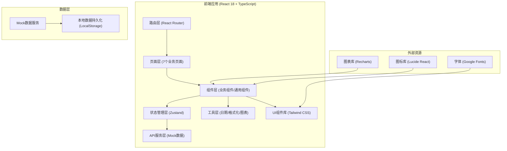
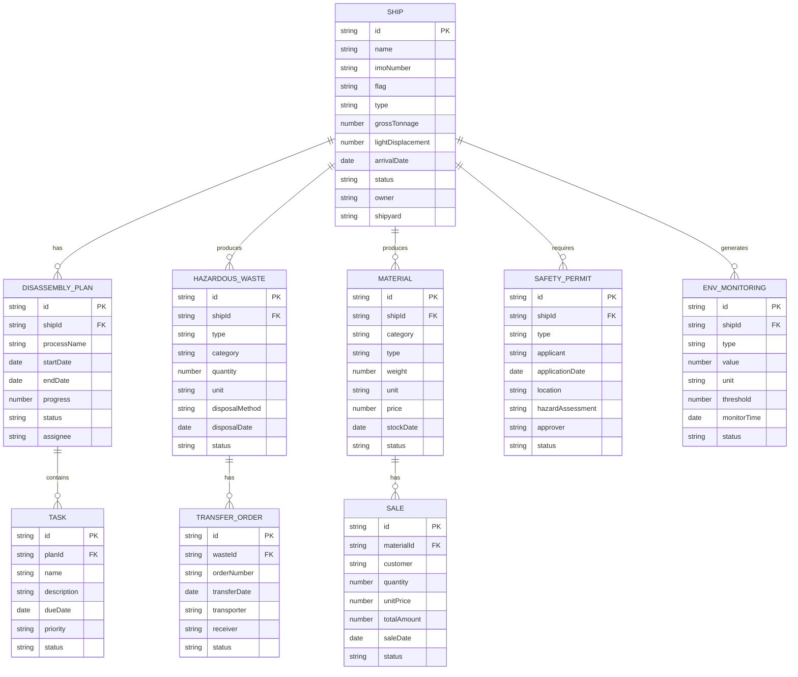

## 1. 架构设计



## 2. 技术描述

- **前端框架**：React 18 + TypeScript
- **构建工具**：Vite 5
- **路由管理**：react-router-dom 6
- **状态管理**：zustand 4
- **UI框架**：Tailwind CSS 3
- **图表库**：recharts 2
- **图标库**：lucide-react 0.344
- **日期处理**：dayjs 1.11
- **后端**：无后端，使用Mock数据 + LocalStorage持久化
- **数据存储**：LocalStorage 存储业务数据

## 3. 路由定义

| 路由 | 页面 | 用途 |
|------|------|------|
| / | 船舶档案 | 系统首页，展示船舶列表和登记入口 |
| /ships | 船舶档案 | 待拆船舶登记、船舶列表、档案管理 |
| /ships/:id | 船舶详情 | 单艘船舶完整档案信息 |
| /plans | 拆解计划 | 拆解工序排程、任务管理、进度看板 |
| /hazmat | 危废处置 | 石棉油污处置、危废转移联单管理 |
| /materials | 物料回收 | 钢材有色金属回收、库存管理 |
| /safety | 安全作业 | 动火许可、有限空间作业、舱室检测 |
| /environment | 环保监测 | 扬尘噪声监测、油污水处理 |
| /statistics | 产销统计 | 废钢销售、拆解进度、综合报表 |

## 4. 数据模型

### 4.1 实体关系图



### 4.2 数据类型定义

```typescript
// 船舶档案
interface Ship {
  id: string;
  name: string;
  imoNumber: string;
  flag: string;
  type: string;
  grossTonnage: number;
  lightDisplacement: number;
  arrivalDate: string;
  status: 'pending' | 'in_progress' | 'completed';
  owner: string;
  shipyard: string;
  description?: string;
  photos?: string[];
  createdAt: string;
  updatedAt: string;
}

// 拆解计划
interface DisassemblyPlan {
  id: string;
  shipId: string;
  shipName: string;
  processName: string;
  startDate: string;
  endDate: string;
  progress: number;
  status: 'not_started' | 'in_progress' | 'completed' | 'delayed';
  assignee: string;
  description?: string;
  tasks?: Task[];
}

// 作业任务
interface Task {
  id: string;
  planId: string;
  name: string;
  description: string;
  dueDate: string;
  priority: 'low' | 'medium' | 'high' | 'urgent';
  status: 'pending' | 'in_progress' | 'completed';
  assignee: string;
}

// 危废
interface HazardousWaste {
  id: string;
  shipId: string;
  shipName: string;
  type: 'asbestos' | 'oil' | 'chemical' | 'battery' | 'other';
  category: string;
  quantity: number;
  unit: string;
  disposalMethod: string;
  disposalDate: string;
  status: 'stored' | 'processing' | 'transferred' | 'completed';
  location: string;
}

// 危废转移联单
interface TransferOrder {
  id: string;
  wasteId: string;
  orderNumber: string;
  transferDate: string;
  transporter: string;
  receiver: string;
  quantity: number;
  status: 'pending' | 'approved' | 'transferred' | 'received';
  documents?: string[];
}

// 回收物料
interface Material {
  id: string;
  shipId: string;
  shipName: string;
  category: 'steel' | 'non_ferrous' | 'other';
  type: string;
  weight: number;
  unit: string;
  price: number;
  stockDate: string;
  status: 'in_stock' | 'sold' | 'reserved';
  warehouse: string;
}

// 销售记录
interface Sale {
  id: string;
  materialId: string;
  materialName: string;
  customer: string;
  quantity: number;
  unitPrice: number;
  totalAmount: number;
  saleDate: string;
  status: 'pending' | 'shipped' | 'completed' | 'cancelled';
  invoiceNumber?: string;
}

// 安全作业许可
interface SafetyPermit {
  id: string;
  shipId: string;
  shipName: string;
  type: 'hot_work' | 'confined_space' | 'high_altitude' | 'cabin_test';
  applicant: string;
  applicationDate: string;
  location: string;
  workContent: string;
  hazardAssessment: string;
  safetyMeasures: string[];
  approver?: string;
  approvalDate?: string;
  validFrom: string;
  validTo: string;
  status: 'draft' | 'pending' | 'approved' | 'rejected' | 'expired';
  gasDetection?: GasDetection;
}

// 气体检测
interface GasDetection {
  oxygen: number;
  flammable: number;
  toxic: number;
  hydrogenSulfide: number;
  carbonMonoxide: number;
  detectionTime: string;
  detector: string;
}

// 环境监测
interface EnvMonitoring {
  id: string;
  shipId?: string;
  type: 'dust' | 'noise' | 'water' | 'air';
  value: number;
  unit: string;
  threshold: number;
  monitorTime: string;
  location: string;
  status: 'normal' | 'warning' | 'exceeded';
  deviceId: string;
}
```

## 5. 项目结构

```
.
├── src/
│   ├── components/          # 通用组件
│   │   ├── layout/         # 布局组件
│   │   │   ├── Sidebar.tsx
│   │   │   ├── Header.tsx
│   │   │   └── MainLayout.tsx
│   │   ├── ui/             # UI基础组件
│   │   │   ├── Button.tsx
│   │   │   ├── Card.tsx
│   │   │   ├── DataTable.tsx
│   │   │   ├── Modal.tsx
│   │   │   ├── Form.tsx
│   │   │   ├── StatusBadge.tsx
│   │   │   └── ProgressBar.tsx
│   │   └── charts/         # 图表组件
│   │       ├── GaugeChart.tsx
│   │       ├── LineChart.tsx
│   │       └── BarChart.tsx
│   ├── pages/              # 页面组件
│   │   ├── ships/          # 船舶档案
│   │   │   ├── ShipList.tsx
│   │   │   ├── ShipDetail.tsx
│   │   │   └── ShipForm.tsx
│   │   ├── plans/          # 拆解计划
│   │   │   ├── PlanBoard.tsx
│   │   │   ├── GanttChart.tsx
│   │   │   └── TaskList.tsx
│   │   ├── hazmat/         # 危废处置
│   │   │   ├── WasteList.tsx
│   │   │   ├── AsbestosDisposal.tsx
│   │   │   ├── OilDisposal.tsx
│   │   │   └── TransferOrderList.tsx
│   │   ├── materials/      # 物料回收
│   │   │   ├── MaterialList.tsx
│   │   │   ├── SteelRecovery.tsx
│   │   │   ├── NonFerrousRecovery.tsx
│   │   │   └── Inventory.tsx
│   │   ├── safety/         # 安全作业
│   │   │   ├── PermitList.tsx
│   │   │   ├── HotWorkPermit.tsx
│   │   │   ├── ConfinedSpace.tsx
│   │   │   └── CabinDetection.tsx
│   │   ├── environment/    # 环保监测
│   │   │   ├── MonitoringDashboard.tsx
│   │   │   ├── DustMonitoring.tsx
│   │   │   ├── NoiseMonitoring.tsx
│   │   │   └── WaterTreatment.tsx
│   │   └── statistics/     # 产销统计
│   │       ├── StatisticsDashboard.tsx
│   │       ├── SalesManagement.tsx
│   │       ├── ProgressStats.tsx
│   │       └── Reports.tsx
│   ├── store/              # 状态管理
│   │   ├── useShipStore.ts
│   │   ├── usePlanStore.ts
│   │   ├── useHazmatStore.ts
│   │   ├── useMaterialStore.ts
│   │   ├── useSafetyStore.ts
│   │   ├── useEnvStore.ts
│   │   └── useStatsStore.ts
│   ├── types/              # 类型定义
│   │   └── index.ts
│   ├── data/               # Mock数据
│   │   ├── mockShips.ts
│   │   ├── mockPlans.ts
│   │   ├── mockHazmat.ts
│   │   ├── mockMaterials.ts
│   │   ├── mockSafety.ts
│   │   └── mockEnv.ts
│   ├── utils/              # 工具函数
│   │   ├── date.ts
│   │   ├── format.ts
│   │   └── storage.ts
│   ├── App.tsx
│   ├── main.tsx
│   └── index.css
├── api/                    # 后端API（预留）
├── package.json
├── tsconfig.json
├── vite.config.ts
├── tailwind.config.js
└── postcss.config.js
```
